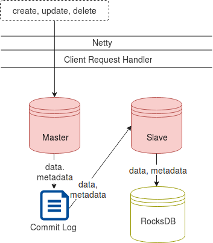
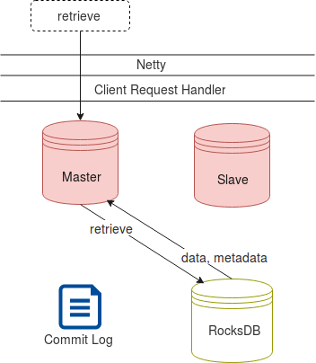
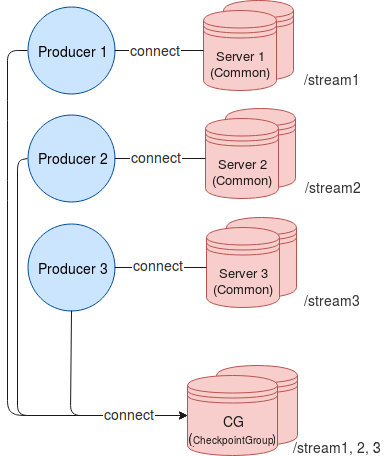

.. _Architecture:

.. Contents::

T-streams Architecture
============================

At this page, we will dive into the T-streams architecture which helps to understand the basic operations. This part will give you a general idea of operation flow and handling.

Overview
------------------

The T-streams architecture is quite simple. Its design is inspired by Apache Kafka. Though the implementation allows us to fulfill the basic aspects of the project - fault-tolerance, scalability, eventual consistency -
offering competitive performance in transactional messaging.

T-streams includes the following components:

1. **Storage Server** that is responsible for all operations performed with the data. More than one server can be involved in the process to enable a fault-tolerant and scalable processing mode.
#. **Producers** that write data into transactions on the Server.
#. **Consumers**, **Subscribers** that read the data from the Server.
#. **Apache ZooKeeper** that is responsible for coordination and synchronization of processes.
#. **Apache BookKeeper** used as a distributed commit log. It is a service that provides persistent storage of streams of log elements. BookKeeper is an optional part used in the multi-node implementation. It orderly stores elements and replicates them across multiple nodes to synchronize the servers' states.

.. figure:: _static/Architecture-General1.png

Thus, Producers get Server's address from ZooKeeper and write transactions with data to it. The Server writes the data and meta-data to the internal commit log and stores data to Server's local storage. Consumers and Subscribers read these data from the Server. 

This is a simplified description of T-streams.

Storage Server
-----------------

The Storage Server is an external process which keeps transactions and their data safe and replicates them for providing high availability. Its structure overview can be displayed in the following way:

The Server consists of two parts: Master and Slave. All operations (i.e. create, retrieve, update, delete a transaction) are performed on Master. 

Master orderly writes the operations to Server's internal commit log or BookKeeper. In the single-node mode Master stores metadata to the commit log, and data (if any exist) directly to the storage (RocksDB). Then Slave reads the operations from the commit log and stores them to RocksDB. RocksDB has a very important feature – an atomic batch operation which allows implementing atomic and reliable commit logs processing. 

Receiving data request, Master takes data from RocksDB to return them to an agent (Consumer or Subscriber):

Agents discover Master Server via Apache ZooKeeper. ZooKeeper returns Server's IP address. Using it, agents connect to the Server to perform the operations.

In the fault-tolerant mode implementation, ZooKeeper returns the address of the Master server to agents. Agents perform operations on Master that registers them in BookKeeper commit log and stores data to the storage. Slaves read from BookKeeper to synchronize their state with Master. 

.. figure:: _static/Architecture-ServerMaster.png

In case Master is down or unavailable, one of the Slaves becomes a Master server. Its address is returned to agents to send all operations to. Once Master is recovered, it will become Slave and will read from BookKeeper the data that is written there by the new Master.

.. figure:: _static/Architecture-ServerSlave.png

In the fault-tolerant mode implementation, one Master and one or more Slave nodes can be deployed. In a most common scenario, one Master and one Slave are in cluster. 

More than one Master server can be included in the cluster. In this case we will speak about a scalable mode that is described below.

The Storage Server is a sub-project which can be found on `GitHub <https://github.com/bwsw/t-streams/tree/develop/tstreams-transaction-server>`_.

Scalable Mode
---------------------

T-streams allows operating in a scalable mode. It is possible in case data processing is implemented via more than one stream as a single stream is not scalable. 

Each stream is assigned to a Master server that has a Common role. All operations within each stream will be sent to its server.

For example, there are 3 streams in the process - Stream 1, Stream 2 and Stream 3. Each of the streams is assigned to a Server that it sends operations to. So we involve 3 servers with a Common role into the processing. Producer 1 working with Stream 1 connects to Server 1. Producer 2 working with Stream 2 connects to Server 2. Producer 3 working with Stream 3 connects to Server 3. 

One more server with a CheckpointGroup role should be added to the cluster to perform all operations for a Checkpoint Group in the process. So all Producers in the runtime will connect to the CheckointGroup server to send operations containing the operations common for all streams in the process.

The checkpoint operation allows fixing a lot of transactions as a single operation. Frequent checkpointing leads to a slowdown in performance, so it is preferable to do checkpoint as rare as possible and use group checkpoint operations.

Data Flow
-------------------

Now having a general idea on the T-streams architecture you can easily understand the data flow in T-streams. 

Look at the figure below. It demonstrates the data flow between a Producer and a Subscriber. 

.. figure:: _static/Architecture-DataFlow.png

Once Subscriber starts, it registers in Apache ZooKeeper. Zookeeper provides Producers with the list of Subscribers in the stream. 

1) Producer sends an open transaction request to Server. Server opens a transaction (``txn1``) and returns an acknowledgment to Producer. Producer sends an open event to Subscriber to inform it of the `txn1` transaction opening.

2) Producer puts data for the ``txn1`` transaction and they are stored to Commit Log and to RocksDB.

3) Producer performs transaction checkpoint. Subscriber receives checkpoint event and gets informed of ``txn1`` is checkpointed. Or in case of Cancel operation, Subscriber receives notification the ``txn1`` transaction is canceled.

4) After the Checkpoint/Cancel operation Subscriber requests Server for data in `txn1`.

