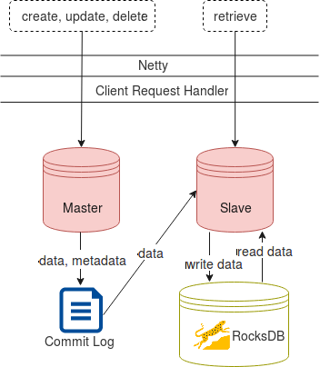

.. _Architecture:

T-streams Architecture
============================

At this page we will dive into the T-streams architecture which helps to understand the data model and basic operations. This part is theoretical and does not include code examples. It can be useful for better understanding of T-streams.

Overview
------------------

The T-streams architecture is quite simple. Its design is inspired by Apache Kafka. Though the implementation allows us to fulfill the basic aspects of the project - fault-tolerance, scalability, consistency offering competitive performance in transactional messaging.

T-streams includes the following components:

1. **Storage Server** that is responsible for all operations performed with the data. More than one server can be involved in the process. 
#. **Producers** who write data into transactions on the Server.
#. **Consumers**, **Subscribers** who read the data from the Server.
#. **Apache ZooKeeper** that is responsible for coordination and syncronization of processes.
#. **Apache BookKeeper** used as a destributed commit log. It is a service that provides persistent storage of streams of log elements. BookKeeper is an optional part useful in multy-node implementation. It replicates stored entries across multiple nodes.

.. figure:: _static/Architecture-General.png

Storage Sever
-----------------

The Storage Server is an external process which keeps transactions and their data safe and replicates them for providing high availability. Agents discover the Storage Server via Apache Zookeeper.

