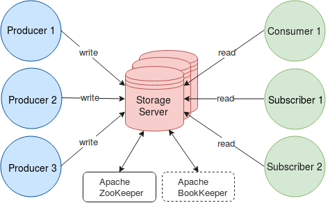
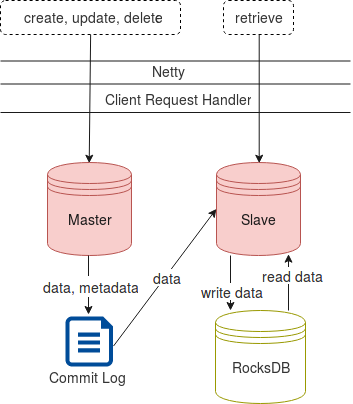
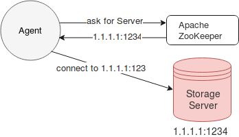
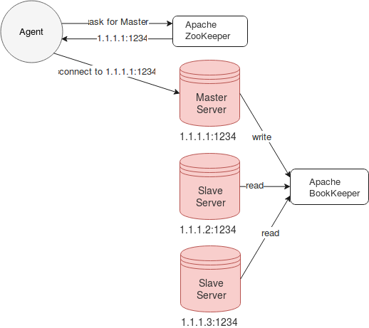
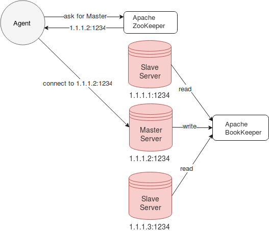

.. _Architecture:

.. Contents::

T-streams Architecture
============================

At this page, we will dive into the T-streams architecture which helps to understand the basic operations. This part will give you a general idea of operation flow and handling.

Overview
------------------

The T-streams architecture is quite simple. Its design is inspired by Apache Kafka. Though the implementation allows us to fulfill the basic aspects of the project - fault-tolerance, scalability, eventual consistency -
offering competitive performance in transactional messaging.

T-streams includes the following components:

1. **Storage Server** that is responsible for all operations performed with the data. More than one server can be involved in the process to enable a fault-tolerant and scalable processing mode.
#. **Producers** that write data into transactions on the Server.
#. **Consumers**, **Subscribers** that read the data from the Server.
#. **Apache ZooKeeper** that is responsible for coordination and synchronization of processes.
#. **Apache BookKeeper** used as a distributed commit log. It is a service that provides persistent storage of streams of log elements. BookKeeper is an optional part used in the multi-node implementation. It orderly stores elements and replicates them across multiple nodes to synchronize the servers' states.

Thus, Producers get Server's address from ZooKeeper and write transactions with data to it. The Server writes the data and meta-data to the internal commit log and stores data to Server's local storage. Consumers and Subscribers read these data from the Server. 

This is a simplified description of T-streams.

Storage Server
-----------------

The Storage Server is an external process which keeps transactions and their data safe and replicates them for providing high availability. Its structure overview can be displayed in the following way:

The Server consists of two parts: Master and Slave. All operations that include state change (i.e. create, update, delete a transaction) are performed on Master. They are orderly written to Server's internal commit log. If any data exist in the operations, they are saved to the Server local storage.

Slave reads the operations from the commit log and stores them to a database (RocksDB). RocksDB has a very important feature – an atomic batch operation which allows implementing atomic and reliable commit logs processing. Slave performs all operations for data retrieving. It reads data from RocksDB to send it to Consumer/Subscriber.

Agents discover Master Server via Apache ZooKeeper. ZooKeeper returns Server's IP address and agents connect to it to perform the operations.

In the fault-tolerant mode implementation, ZooKeeper returns the address of the Master server to agents. Producers write operations to Master that registers them in BookKeeper commit log and stores data to the storage. Slaves read from BookKeeper to synchronize their state with Master. 

In case Master is down or unavailable, one of the Slaves becomes a Master server. Its address is returned to agents to send all operations to. Once Master is recovered, it will become Slave and will read from BookKeeper the data that is written there by the new Master.

In the fault-tolerant mode implementation, one Master and one or more Slave nodes can be deployed. In a most common scenario, one Master and one Slave are in cluster. 

The Storage Server is a separate project which can be found on `GitHub <https://github.com/bwsw/tstreams-transaction-server>`_.

Scalable Mode
---------------------

