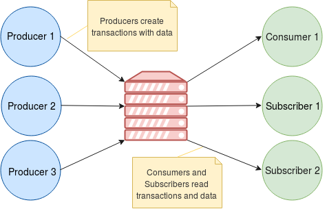
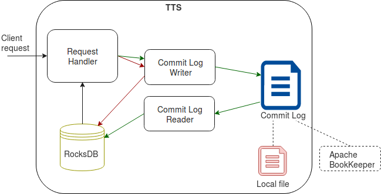

.. _Architecture:

.. Contents::

T-streams Architecture
============================

At this page, we will dive into the T-streams architecture which helps to understand the basic operations. This part will give you a general idea of operation flow and handling.

Overview
------------------

The T-streams architecture is quite simple. Its design is inspired by Apache Kafka. Though the implementation enables us to fulfill the requirements - fault-tolerance, scalability, eventual consistency -
offering competitive performance in transactional messaging.

T-streams includes the following components:

1. **Storage Server** that is responsible for all operations performed with transactions and their data. Server contains a local storage and a commit log. Local storage is implemented with `RocksDB <http://rocksdb.org/>`_. A commit log can be an internal file or a distributed commit log service provided by `Apache BookKeeper <https://bookkeeper.apache.org/>`_.
#. **Producers** that create transactions with data.
#. **Consumers**, **Subscribers** that read the transactions.

You can see a general description of them at the figure below:

T-streams can be configured in two modes:

1) In a single-node mode providing non-fault tolerant processing;
2) In a multi-node mode providing 
     
     - fault-tolerant processing by backing up servers,
     - scalability implemented with sharded servers.

Any configuration requires infrastructure. In the next section you will find more information on infrastructure components in T-streams.

Infrastructure Components
~~~~~~~~~~~~~~~~~~~~~~~~~~~~~~~~~
The following infrastructure components are required in T-streams:

1. **Apache ZooKeeper** that is responsible for coordination and synchronization of processes.
#. **RocksDB** that is an embedded database fulfilling a very important feature – an atomic batch operation which allows implementing atomic and reliable commit logs processing. 
#. **Apache BookKeeper** used as a distributed commit log. It is a service that provides a persistent, fault-tolerant log-structured storage. BookKeeper is an optional part used in the fault-tolerant configuration. It orderly stores elements and replicates them across multiple nodes to synchronize the servers' states. In a single-node configuration BookKeeper is not required. Server's internal commit log file is used instead.

At the figure below T-streams infrastructure is presented: 

Thus, Server publishes an endpoint to ZooKeeper. Agents (eg. Producers and Consumers) read the endpoint, discover Server and connect to it to create/read transactions with data. 

Producers write the operations, transactions with data and meta-data to Server's internal commit log, or BookKeeper in the multi-node configuration, and stores data to Server's local storage. Consumers and Subscribers read these transactions and their data from the Server's storage. See the :ref:`Data_Flow` section for more details on data flow in T-streams.

This is a simplified description of T-streams architecture and operations. Next we will gain a deeper insight into T-streams key component - T-streams Transaction Storage Server.

T-streams Transaction Storage Server
--------------------------------------

The T-streams Transaction Storage Server (TTS) is an external process which keeps transactions and their data safe. Its abstract architecture can be represented in the following way:

The Server contains the internal parts: 
 
 - Request Handler; 
 - Commit Log Writer; 
 - Commit Log Reader;
 - Commit Log that can be implemetned as an internal file or BookKeeper;
 - RocksDB storage.
 
Request Handler processes all operations (i.e. create, retrieve, update, delete a transaction) and write them to Commit Log via Commit Log Writer. 

Commit Log Writer orderly writes the operations to Server's internal commit log or BookKeeper. Then Commit Log Reader reads the operations from the commit log and stores them to RocksDB. Receiving data request, Request Handler reads transactions and their data from RocksDB to return them to an agent (Consumer or Subscriber).

In the single-node mode the recording of transaction operations differs from recording of data operations. Commit Log Writer records meta-data to the commit log, storing data (if any exist in an operation) directly to RocksDB. In the figure below the meta-data recording is displayed with green arrows. Data recording flow is displayed with red arrows. 

Agents discover the Leader server via Apache ZooKeeper. ZooKeeper returns Server's IP address. Using it, agents connect to the Server to perform the operations.

In the fault-tolerant mode implementation, ZooKeeper returns the address of the Leader server to agents. Agents perform operations on Leader that registers them in BookKeeper commit log and stores data to the storage. Followers read from BookKeeper to synchronize their state with the Leader. 

In case Leader is down or unavailable, one of the Followers becomes a Leader server. Its address is returned to agents to send all operations to. Once the former Leader is recovered, it becomes a Follower and starts reading the data that is written by the new Leader in BookKeeper.

In the fault-tolerant mode implementation, one Leader and one or more Followers can be deployed. In a most common scenario, one Leader and one Follower are in a cluster. 

Servers can be backed up. In this case we will speak about a scalable mode that is described below.

The Storage Server is a sub-project which can be found on `GitHub <https://github.com/bwsw/t-streams/tree/develop/tstreams-transaction-server>`_.

Scalable Mode
---------------------

T-streams allows operating in a scalable mode. It is possible in case data processing is implemented via more than one stream as a single T-streams stream is not scalable. 

Each stream is assigned to a Leader server that has a Common role. All operations within each stream will be sent to its server.

For example, there are 3 streams in the process - Stream 1, Stream 2 and Stream 3. Each of the streams is assigned to a Server. So we involve 3 servers with a Common role into the processing. Producer 1 working with Stream 1 connects to Server 1. Producer 2 working with Stream 2 connects to Server 2. Producer 3 working with Stream 3 connects to Server 3. 

One more server with a CheckpointGroup role should be added to the cluster to perform all operations common for all streams in the process. So all Producers in the runtime will connect to the CheckointGroup server to send operations containing the operations for a Producer or Checkpoint Group object.

.. figure:: _static/Architecture_Scale1.png

The checkpoint operation allows fixing a lot of transactions as a single operation. Frequent checkpointing leads to a slowdown in performance, so it is preferable to do checkpoint as rare as possible and use group checkpoint operations.

.. _Data_Flow:

Data Flow
-------------------

Now having a general idea of the T-streams architecture you can easily understand the data flow in T-streams. 

Look at the figures below. They demonstrate the data flow between a Producer and a Subscriber. 

Let us consider them step by step. 

1) Once Subscriber starts, it registers in Apache ZooKeeper (1.1). Zookeeper provides Producers with the list of Subscribers in the stream (1.2). 

2) Producer sends an open transaction request to Server (2.1). Server opens a transaction (``txn1``) and returns an acknowledgment to Producer. Producer sends an open event to Subscriber to inform it of the ``txn1`` transaction opening (2.2). Server writes the operation to Commit Log (2.3).

3) Producer puts data for the ``txn1`` transaction and they are stored to Commit Log and to RocksDB (3.2, 3.3).

.. figure:: _static/Architecture-DataFlow_Prod2.png

Once all data are stored for the transaction, they get available to Subscriber. It is fulfilled with the following operations:

1) Producer performs transaction checkpoint/canceling (1.1). After receiving the acknowledgement of the ``txn1`` checkpoint/cancel, Producer sends the transaction checkpoint/cancel notification to Subscriber (1.2). Server writes the checkpoint operation to Commit Log (1.3). 

2) Subscriber receives checkpoint event and gets informed of ``txn1`` is checkpointed. Or in case of Cancel operation, Subscriber receives notification the ``txn1`` transaction is canceled. Now Subscriber can request
Server for data in `txn1` (2.1).

3) Server reads data from RockesDB (2.2) and returns them to Subscriber (2.3)

.. figure:: _static/Architecture-DataFlow_Subscr3.png

