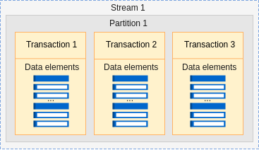
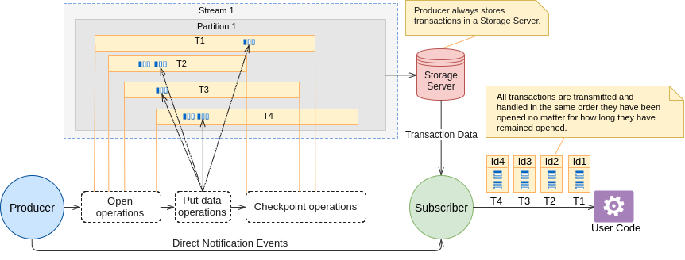
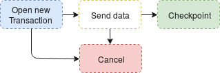
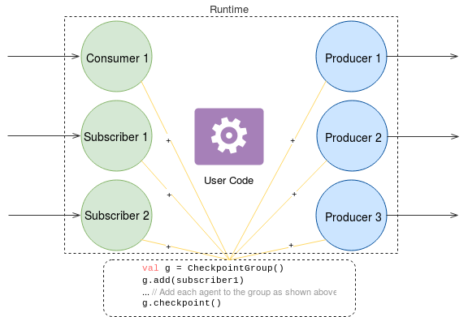

.. _Intro:

Introduction
===============

.. Contents::

Overview
------------------

T-streams (transactional streams) is a Scala library and infrastructure components which implement transactional messaging, important for many practical applications including CEP (complex event processing), financial and business-critical systems that must process events exactly-once, at-least-once or at-most-once depending on a chosen processing way. 

T-streams library implements transactional persistent queues for exactly-once, batch message exchange in PUB-SUB mode. It allows storing streams of records in a fault-tolerant way. 

T-streams can be implemented:

- as a distributed, replicated **message broker** and a client library for JRE (like a Kafka, RabbitMQ, etc.);
- as a **storage**;
- as a **commit log** system.

T-streams library uses robust data management systems for operation:

* Apache Zookeeper – for distributed coordination;
* Apache BookKeeper – for eventually consistent replicated commit log system;
* RocksDB – operational storage.

The deployment can be configured in one of the modes:

1. Non-fault tolerant in a single-node mode,
#. Fault-tolerant in a multi-node mode,
#. Embedded mode convenient for testing.

Find more about configurations and architecture in the `Deployment_Guide`_.

It is implemented with Scala 2.12, Apache Curator, Google Netty, Google Guava and other standard sound components purposed for the development of reliable distributed applications.

T-streams is licensed under Apache 2.0 license.

When Use T-streams
-------------------

In general, T-streams are expected to be used in business-critical tasks that require:

- strict exactly-once ETL operations (read from A, handle and write to B as a transaction);
- expect an event initiated first is handled first despite the span of the event (e.g. financial and banking accounts operations);
- fat or slowly terminating events (e.g. an event triggers and next gathers a lot of different metrics which are sent to event and next closes);
- long-lasting pending operations which are expected to be canceled on a manager crash.

Being developed for exactly-once processing, T-streams also offers the semantics for the fire-and-forget mode without guarantees (i.e. at-most-once delivery).

About T-streams 
-----------------

We started T-streams as a compliment for Apache Kafka, which is perfect but lacks some features that may be critical in some business cases. Kafka is widely used but does not fit well for CEP systems where processing chain can be complex and involve Kafka-to-Kafka processing (like Apache Samza does, for example).

* Unlike Kafka that operates with topics and partitions with data, T-streams handle events as atomic *transactions*. Transactions are opened in a strict order. They are processed then exactly in the same order. A transaction can be long-living while new data elements are added to it, and closes by a checkpoint.  It is important that all data related to one transaction are written to the stream once available and into this exact transaction. And it is not necessary to collect all the elements before pulling them into the stream.

* Alongside with Consumers which implement polling processing, we have added one more agent type - *Subscribers* - which implement PUB-SUB processing. It makes it faster to receive new data for processing as there is no need to send extra requests for new events (like a Consumer does). New messages are reсeived by a Subscriber in a short time and can be processed as soon as they are put into the stream. It helps to make latency as low as possible.

* Kafka consumers put somewhere (usually in Zookeeper) an offset from which they will restart processing data in case of failure. We offer storing offsets *within T-streams*. It saves time when accessing data. It also allows *exactly-once* processing as it is supported by all agents and both Producers and Consumers/Subscribers can do the CheckpointGroup operation 

* T-streams allows starting data consuming from the oldest offset, from the most recent offset, from the last fixed offset and from an *arbitrary date-time offset*. 

* Moreover, a Consumer can get data from a *specific transaction* determined by its ID, as well as from a range of transactions if specifying several IDs. It makes a stream operate as a data storage. Historical data is available and can be easily accessed.

* T-streams architecture supports scalability and fault-tolerance allowing deployment in a multi-node mode.

Concepts
-----------

The T-streams conceptual design is inspired by Apache Kafka. Though its architecture differs in some specific aspects that allow implementing the key features described above. Below we will dive into the basic concepts of the project. 

Streams, Partitions and Transactions
~~~~~~~~~~~~~~~~~~~~~~~~~~~~~~~~~~~~~~~~~

T-streams look as it is displayed in the figure below:

A **Stream** is a top-level concept. 

Every T-streams stream consists of one or more **partitions**. Partitions are used for load balancing and data distribution. Upon creation, every stream gets a name and certain amount of partitions. A partition concept is used to distribute all streams to ordered independent substreams which are handled separately by workers. 

Every partition holds **transactions** inside. We have implemented a transaction as a basic object in T-streams.

.. A Producer opens a new transaction and it remains open until all data elements are put in there. Then the Producer does checkpoint which fixes the transaction and makes it available to a Consumer/Subscriber. Otherwise, if the Producer decides that the data inside the transaction is invalid it cancels the transaction and invalidates it. Transactions can be long-living or short-living. For long-living transactions a Producer calls the "update" method that keeps the transaction alive and prevents it from canceling. Transaction status flow is presented below: 
.. figure: _static/transaction-states.png

Transactions are:

- short-living and long-living;
- stored in streams' partitions;
- are *strictly ordered* inside a partition according to the transaction open time (who opens first will be processed first);
- *persistent*, stored in the replicated data store and evicted after specified period of time, e.g. week or month;
- persisted with the *checkpoint* operation;
- canceled with the *cancel* operation;
- designed to build transactional *producers*;
- processed by transactional
 - *consumers* which implement polling processing;
 - *subscribers* which implement PUB-SUB processing. 

A Producer opens transactions in a strictly ordered mode, e.g. T1, T2, T3, T4. It is fair for different producers within the same partition as well. The Producer can checkpoint or cancel them in the arbitrary order. But even if T2 and T3 are checkpointed before T1, the handling of them by a Subscriber will be delayed until T1 is checkpointed. The processing order is displayed in the figure below.

You will find more about T-streams agents in the section below.
 
Agents
~~~~~~~~~~~
Basically, T-streams is designed for exactly-once processing. So it includes an idempotent Producer, a Consumer and a Subscriber. Every agent works with a specific stream and specific partitions. Agents can be grouped in a Checkpoint Group.

You can read about each agent and a Checkpoint Group object below.

Producer
""""""""""""""""

Producers push new transactions. From Producer's point of view, when it determines that some amount of data must be “fixed” for sure, it closes a transaction (does **checkpoint**), which makes the data inside that transaction available for Consumers and Subscribers.

A Producer can checkpoint all opened transactions atomically by calling the checkpoint method. It also can cancel all of them by calling the cancel method.

Producer Transaction
'''''''''''''''''''''''''
1. When a Producer wants to put data inside T-streams, it *opens* a new transaction. 

#. That transaction receives all data related to it. If at the moment the transaction is complete (all data is in place), then the Producer calls the *checkpoint* method that fixes the transaction. 

#. Otherwise, if a Producer decides that data is invalid inside the transaction it calls the *cancel* method, which invalidates the transaction, and forgets about it.

Consumer
""""""""""""
Consumer iterates over transactions from the earliest to the latest and reads data from every transaction. After a transaction (or transaction set) was handled properly, the Consumer does checkpoint which means that even in a cause of a crash or for another reason, that consumer will start processing the transaction which is the next to the processed one.

Consumer Transaction
''''''''''''''''''''''''''

Consumer Transaction is the basic object which every Consumer uses to fetch data from T-streams. Actual workflow is the next:

1. The Consumer *gets* new Consumer Transaction.

#. The Consumer *gets all the data* from Consumer Transaction.

#. The Consumer does *checkpoint* (not necessary for every Consumer Transaction).

Subscriber
""""""""""""""

A Subscriber extends a Consumer and operates in a PUB-SUB mode rather than in a polling mode. So, a developer does not need to do periodic reads to get new transactions. Rather, the developer just implements a callback class which receives new transactions as soon as they are available to the Subscriber. A Subscriber also does checkpoints when it is necessary to “fix” computations.

Consumers and Subscribers:

- poll or PUB-SUB transactions from:
 - most recent offset;
 - arbitrary date-time offset;
 - most ancient offset;
 - last fixed offset.
- can read a transaction by certain transaction ID;
- can read transactions in the range;
- fix their current state with the checkpoint operation. 

Checkpoint Group
""""""""""""""""""""
**Checkpoint Group** is the key object guaranteeing exactly-once processing of data. It is implemented to perform the atomic checkpoint for a group of producers and consumers in one process.

The **Checkpoint** operation is atomic for:

- a single transaction when it is called for a transaction object;
- for all opened transactions of a Producer when it is called for a Producer object;
- for all Producers, Consumers and Subscribers which are participants of a Checkpoint Group when it is called for a CheckpointGroup object.

Guarantees
------------

T-streams gives the following guarantees:

- Consumers/Subscribers process transactions in a strict order according to transaction open time. The first opened transaction blocks the processing of following transactions until it is checkpointed.
- Consumers/Subscribers read data elements in a transaction in the order Producers have recorded them.  
- All events are written to a stream exactly-once. The checkpoint operation ensures duplicate check rejecting duplicate transactions and records.

The current status of T-streams is Technical release 2.5.0. We assume issues may occur, and if you face any bugs you are warmly welcome to contact the team and contribute to the project. 

Performance Tips
------------------

The stream processing velocity depends on a number of transactions in a partition and a number of data elements within a transaction. 

Since a transaction is not equal to a data element and it can include a lot of data elements, then when data elements can be batched it can give 1M of data elements per second only with 1000 of transactions of 1000 data elements each. So, to achieve *higher throughput* we suggest trying to minimize transaction amount and maximize the transaction payload.

The *checkpoint operation* allows fixing a lot of transactions as a single operation. Frequent checkpointing leads to a slowdown in performance, so it is preferable to call the checkpoint method as required, using Producer or Checkpoint Group (but not Transaction object) methods. 

T-streams single stream is not scalable. One stream is handled on one server. In this case, the processing is limited by the server performance. If the processing flow you develop allows scalability, you can handle each stream on a separate server observing all the guarantees mentioned above. *Scalability* allows processing high throughputs of data with very low latency. 
